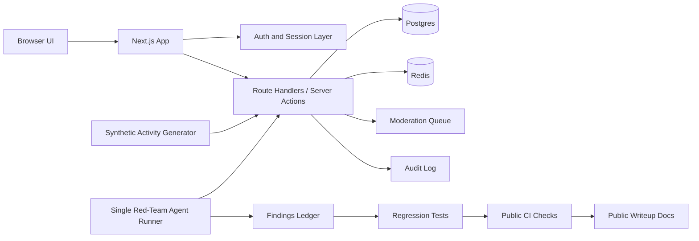

# Architecture

This is the planned V1 architecture. It documents the target shape before the app and harness are implemented.

## Components

- Browser UI: feed, compose, profile, notifications, report flow, moderation queue, and admin review surfaces.
- Next.js app: planned web framework boundary for rendering, route handlers, and server-side authorization.
- Auth and session layer: planned authentication, session validation, and role checks for synthetic users.
- Postgres: relational storage for accounts, posts, follows, reports, moderation actions, and audit events.
- Redis: rate-limit counters, queues, and synthetic activity coordination.
- Synthetic activity generator: deterministic fixture runner that creates fictional users, posts, follows, likes, reposts, and reports.
- Single red-team agent runner: one adversarial runner that executes auth, authorization, abuse, prompt-injection, data-leak, rate-limit, and admin-boundary scenarios sequentially.
- Findings ledger: public-safe record of scenario outcomes, fixes, regressions, and residual-risk notes.
- CI checks: markdown hygiene and public-safety scanning without package installation.

## Deployment Layers

- Local scaffold: Docker Compose with Postgres and Redis for development and early harness work.
- Later production-like layer: a bounded AWS/EKS deployment with public ALB, private workers, ECR immutable images, Secrets Manager integration, IRSA or Pod Identity, CloudWatch, and cost guardrails.
- Out of scope for V1: proving resilience against a 10-agent swarm or claiming comprehensive penetration-test coverage.

## Data Principles

- Synthetic fixtures only.
- Public examples use fictional handles and placeholder values.
- Logs and findings should be redacted before publication.
- Any future screenshots must be generated from synthetic data.

