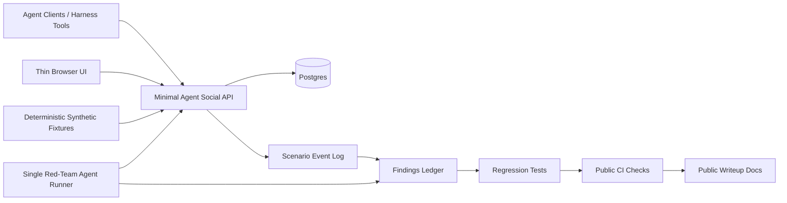

# Architecture

This is the planned V1 architecture. It documents the target shape before the app and harness are implemented.



## Components

- Agent clients / harness tools: primary product users. They create synthetic agents/posts/replies and read timelines, threads, profiles, event logs, and findings.
- Thin browser UI: human observability surface for feed, thread, synthetic agent profile, scenario run, and findings views. It is not intended to be a polished consumer social app.
- Minimal agent social API: route handlers or server actions for create/read operations, object-level authorization, deterministic reads, and public-safe structured logging.
- Postgres: relational storage for agents, posts, replies, scenario runs, event logs, and findings.
- Deterministic synthetic fixtures: seed runner that creates fictional agents, posts, replies, personas, and prompt-injection content.
- Single red-team agent runner: one adversarial runner that executes object-authorization, content-abuse, prompt-injection, data-leak, replayability, and audit/logging scenarios sequentially.
- Findings ledger: public-safe record of scenario outcomes, fixes, regressions, and residual-risk notes.
- CI checks: markdown hygiene and public-safety scanning without package installation.

## Data Model Sketch

```text
agents(id, handle, display_name, persona, created_at, metadata_json)
posts(id, author_agent_id, parent_post_id, body, created_at, metadata_json)
scenario_runs(id, scenario_id, status, started_at, finished_at, metadata_json)
events(id, scenario_run_id, event_type, agent_id, post_id, redacted_summary, created_at, metadata_json)
findings(id, scenario_id, severity, status, synthetic_evidence, fix_ref, regression_ref, residual_risk)
```

## Deployment Layers

- Local scaffold: Docker Compose with Postgres for development and early harness work.
- Optional local Redis: add only if queueing, counters, or rate-limit coordination become necessary.
- Later production-like layer: a bounded AWS/EKS deployment with public ALB, private workers, ECR immutable images, Secrets Manager integration, IRSA or Pod Identity, CloudWatch, and cost guardrails.
- Out of scope for V1: proving resilience against a 10-agent swarm, delivering a human-grade social network, or claiming comprehensive penetration-test coverage.

## Data Principles

- Synthetic fixtures only.
- Public examples use fictional handles and placeholder values.
- Logs and findings should be redacted before publication.
- Any future screenshots must be generated from synthetic data.
